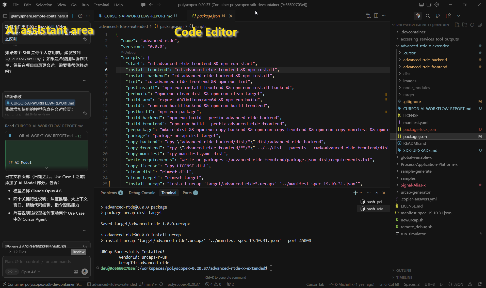
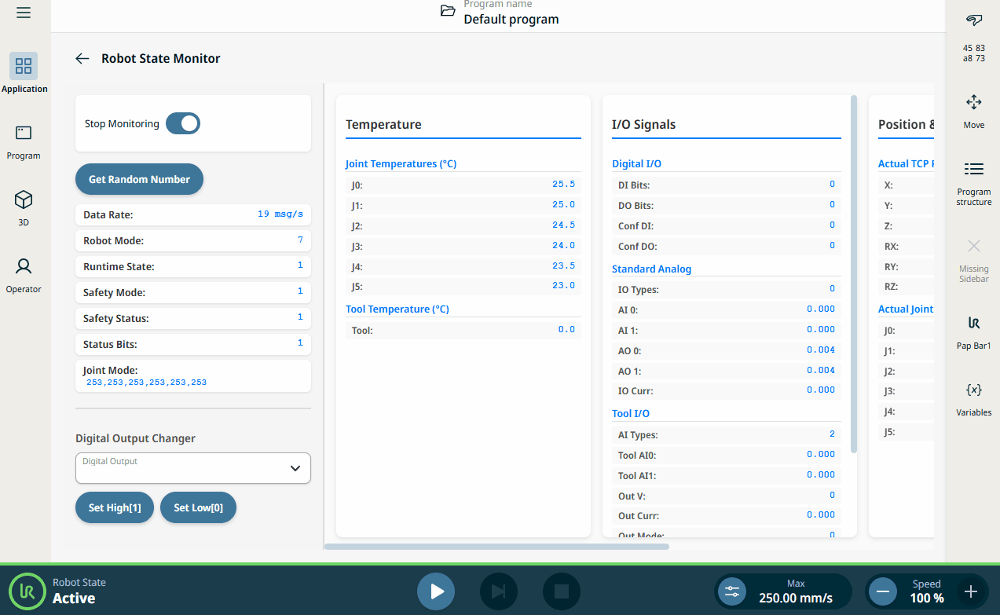

Cursor AI-Assisted URCap Development
====================================

This guide demonstrates how Cursor AI can accelerate URCap development through intelligent automation.

.. note::
   Date: 2026-03-25

----

Adopted AI Model
--------

**Claude Opus 4.6** — Anthropic's most capable model. Deep reasoning, large context window, precise code editing.

Development Environment
-----------------------

----

Use Case 1: SDK Dependency Upgrade
-----------------------------------

Challenge
^^^^^^^^^

Upgrading URCap SDK requires comparing multiple ``package.json`` across backend, frontend, and root directories — manual, repetitive, error-prone.

Solution: 3-Stage AI-Assisted Workflow
^^^^^^^^^^^^^^^^^^^^^^^^^^^^^^^^^^^^^^^

.. raw:: html

   

   

     

       

         Stage 1 — Granular Comparison & Automated Modification
         ▼
       

       

         
Cursor batch-reads all <code>package.json</code> files, diffs every version, and applies precise updates.

         
<strong>What Cursor identified and updated automatically:</strong>

         <table>
           <thead>
             <tr>
               <th>Package</th>
               <th>Before</th>
               <th>After</th>
             </tr>
           </thead>
           <tbody>
             <tr>
               <td><code>@universal-robots/ui-angular-components</code></td>
               <td>21.2.25</td>
               <td>21.3.189</td>
             </tr>
             <tr>
               <td><code>@universal-robots/contribution-api</code></td>
               <td>21.2.25</td>
               <td>21.3.131</td>
             </tr>
             <tr>
               <td><code>@universal-robots/designtokens</code></td>
               <td>21.2.25</td>
               <td>21.3.85</td>
             </tr>
             <tr>
               <td><code>@universal-robots/ui-models</code></td>
               <td>21.2.25</td>
               <td>21.3.85</td>
             </tr>
             <tr>
               <td><code>@universal-robots/utilities-units</code></td>
               <td>21.2.25</td>
               <td>21.4.17</td>
             </tr>
             <tr>
               <td><code>rimraf</code> (root)</td>
               <td>3.0.2</td>
               <td>5.0.7</td>
             </tr>
             <tr>
               <td><code>rimraf</code> (backend)</td>
               <td>^3.0.2</td>
               <td>5.0.7</td>
             </tr>
             <tr>
               <td><code>manifest-spec</code> path</td>
               <td>19.10.24</td>
               <td>19.10.31</td>
             </tr>
           </tbody>
         </table>
       

     

     

       

         Stage 2 — Auto-Generated Documentation
         ▼
       

       

         
Cursor generated <a href="https://github.com/FuNingHu/advanced-rtde-x-extended/blob/main/SDK-UPGRADE.md" target="_blank"><code>SDK-UPGRADE.md</code></a> (with link to the note) with checklist, change table, post-upgrade commands, and notes — replacing 20–30 min of manual writing with ~30 seconds.

       

     

     

       

         Stage 3 — Reusable Skill
         ▼
       

       

         
Created <code>.cursor/skills/urcap-sdk-upgrade/SKILL.md</code> encoding 6 steps:

         <table>
           <thead>
             <tr>
               <th>Step</th>
               <th>Manual</th>
               <th>Cursor AI</th>
             </tr>
           </thead>
           <tbody>
             <tr>
               <td>Read & compare 6+ package.json files</td>
               <td>Open tabs side by side, line-by-line scan</td>
               <td>Batch read in one operation, instant diff</td>
             </tr>
             <tr>
               <td>Identify version mismatches</td>
               <td>Easy to miss subtle differences</td>
               <td>Zero misses — every package checked</td>
             </tr>
             <tr>
               <td>Apply updates</td>
               <td>Copy-paste one by one, risk of typos</td>
               <td>Targeted string replacement, exact edits</td>
             </tr>
             <tr>
               <td>Catch non-obvious issues (manifest path, .gitignore)</td>
               <td>Often overlooked</td>
               <td>Automatically detected and fixed</td>
             </tr>
             <tr>
               <td><strong>Total time</strong></td>
               <td><strong>~1 hour</strong></td>
               <td><strong>~5 minutes</strong></td>
             </tr>
           </tbody>
         </table>
         
Any team member can trigger this Skill with <em>"Upgrade the SDK"</em>.

         
This Skill is open-sourced for all URCap developers: 
         <a href="https://github.com/FuNingHu/advanced-rtde-x-extended/tree/main/.cursor/skills/urcap-sdk-upgrade" target="_blank" style="font-size: 1.2em;">urcap-sdk-upgrade Skill on GitHub</a>

       

     

   

   

Summary
^^^^^^^

.. list-table::
   :header-rows: 1
   :widths: 30 20 20 30

   * - Metric
     - Before
     - After
     - Improvement
   * - Execution time
     - ~1 hour
     - ~5 min
     - **10x faster**
   * - Documentation
     - 20–30 min
     - ~30 sec
     - **Automated**
   * - Repeatability
     - Tribal knowledge
     - Codified Skill
     - **Permanent**
   * - Error rate
     - Human-dependent
     - Near zero
     - **Reliable**

----

Use Case 2: Advanced UI — Dynamic Draggable Panels
---------------------------------------------------

Challenge
^^^^^^^^^

Building draggable panels, resizable areas, or dynamic layouts in URCap requires deep Angular/CSS expertise and PolyScope X iframe constraints knowledge — a high barrier for most developers.

Solution
^^^^^^^^

Developers describe desired UI in natural language; Cursor generates complete implementations.

Result Demo
^^^^^^^^^^^

.. raw:: html

   

Advanced URCap Features Enabled
^^^^^^^^^^^^^^^^^^^^^^^^^^^^^^^^

.. list-table::
   :header-rows: 1
   :widths: 35 65

   * - Feature
     - Description
   * - **Drag-and-drop reordering**
     - Operators rearrange parameter cards, signal lists, or configuration blocks
   * - **Dynamic form builder**
     - Add/remove/reorder form fields at runtime
   * - **Collapsible sections**
     - Expand/collapse content areas to manage screen real estate
   * - **Interactive data tables**
     - Sortable, filterable tables with inline editing
   * - **Real-time data visualization**
     - Live charts and graphs for RTDE data streams

Development Acceleration
^^^^^^^^^^^^^^^^^^^^^^^^

.. list-table::
   :header-rows: 1
   :widths: 35 32 33

   * - Task
     - Manual
     - Cursor AI
   * - Implement drag-and-drop from scratch
     - 4–8 hours (research + code + debug)
     - ~15 minutes (describe + generate + refine)
   * - Create responsive resizable layout
     - 2–4 hours
     - ~10 minutes
   * - Add layout persistence with localStorage
     - 1–2 hours
     - ~5 minutes
   * - Integrate with PolyScope X height constraints
     - Trial and error
     - Instant — leverages existing Skill knowledge

Use Case 2 Summary
^^^^^^^^^^^^^^^^^^

.. list-table::
   :header-rows: 1
   :widths: 30 20 30 20

   * - Metric
     - Before
     - After
     - Improvement
   * - Advanced UI implementation
     - 4–8 hours
     - ~15 minutes
     - **16–32x faster**
   * - Required Angular expertise
     - Advanced
     - Basic (AI handles complexity)
     - **Lower barrier**
   * - UI feature richness
     - Static layouts
     - Dynamic, interactive panels
     - **Enhanced UX**
   * - Iteration speed
     - Hours per change
     - Minutes per change
     - **Rapid prototyping**
