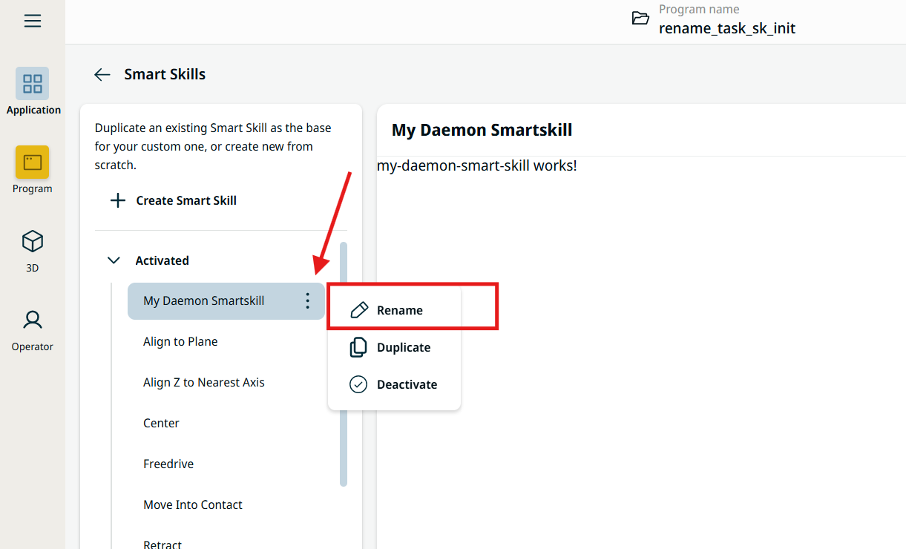
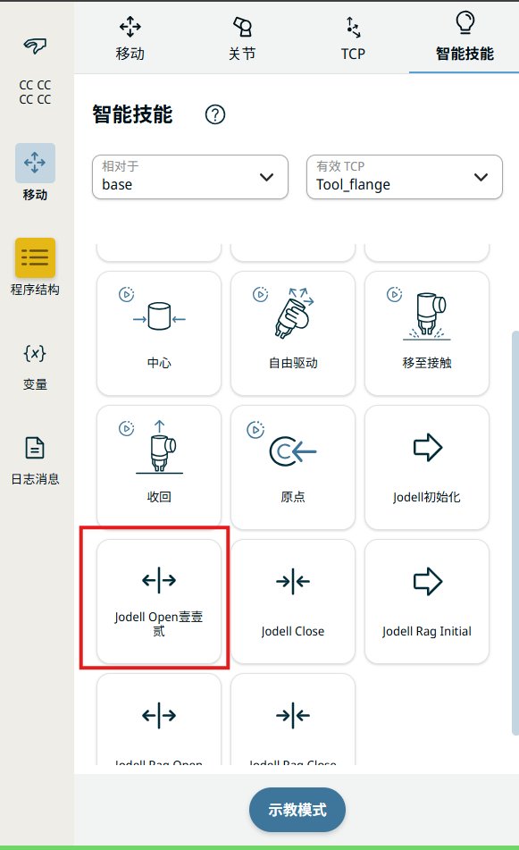

Change a Smart Skill Title by URCap
==========================================

This article explains what a Smart Skill is, and shows the different ways to
change the title (display name) shown to the user — both manually and through
the URCap code, including how to make the title translatable.

.. note::
   Special thanks to our UR colleague **Jens-Jakob Bentsen** for his patient
   guidance and help, without which this article would not have been possible.

   **Tested on:** PolyScope 10.13 and SDK 0.20.49 ·
   **Created:** 2026-Aug-04 ·
   **Last Updated:** 2026-Aug-04

----

1. What is a Smart Skill?
-------------------------

.. raw:: html

   
A <strong>Smart Skill</strong> is a quick-access behavior that the user can
   start and stop from the <strong>move drawer</strong>, helping achieve a
   smoother and faster programming experience. The behavior itself is defined in
   <strong>URScript</strong> and has the same rights as any regular program — it
   can call the backend (e.g. via ROS 2 or XML-RPC), move the robot, or control
   peripheral equipment directly. For the full reference, see the SDK guide:
   <a href="https://docs.universal-robots.com/PolyScopeX_SDK_Documentation/build/SDK-v0.21/HowToGuides/smart-skill.html" target="_blank">Smart Skills Contributions</a>.

Smart Skills come in two kinds:

- **Discrete** — a brief, well-defined action with a clear beginning and end;
  it terminates automatically without user input (e.g. toggle a gripper).
- **Continuous** — no apparent beginning or end; the user has to terminate it
  (e.g. putting the robot into freedrive mode).

**Typical use cases:** open/close a gripper, jog to a taught pose, enable
freedrive, trigger a camera, or any short helper action the operator wants at
their fingertips while programming.

.. seealso::
   For an overview of the more PolyScope X contribution types (Sidebar,
   Application, Program Node, Operator Screen, and Smart Skill), see
   :doc:`urcap_contribution_overview`.

----

2. Change the title manually
----------------------------

The quickest way — no code required:

1. Go to **Application → Smart Skill** page.
2. Select your Smart Skill.
3. Click **Rename** and type the new title.

This only changes the title for the current application; it is not baked into
the URCap and will not follow the URCap to another installation.

----

3. Set the initial title via URCap
-----------------------------------

To ship a default title with the URCap, set the ``name`` field returned by
``factory()`` in the Smart Skill's ``*.behavior.worker.ts`` file. The value of
``name`` is what PolyScope X uses to set the Smart Skill node's title **the first
time it loads the node**.

.. code-block:: typescript

   const createSmartNode = (): OptionalPromise<JodellSmartSkillInstance> => ({
       type: 'universal-robots-contribution-jodell-smart-skill',
       name: 'Jodell Initial116',
       baudrate: '115200',
       gripperID: 9,
       enabled: true,
       parameters: {
       },
   });

   const behaviors: SmartSkillBehaviors = {
       // factory is required
       factory: createSmartNode,
       // factory: () => {
       //     return {
       //         type: 'universal-robots-contribution-jodell-smart-skill',
       //         name: 'Jodell Initial',
       //         parameters: {
       //         },
       //     };
       // },
       // ...
   };

Here the ``name`` value (``Jodell Initial116``) becomes the node's title on first
load. If you want that title to be **translatable / localized**, use ``name`` as
an i18n key instead (see the next section).

----

4. Prepare the title translation (i18n)
---------------------------------------

Under the ``smart_skills`` object, each Smart Skill has its own translation
block. The structure is::

   smart_skills → <kebab-name> → title (+ other UI field labels)

- **kebab-name** (the middle layer): this key must equal the ``name`` returned by
  ``factory()``, **converted to lowercase with spaces replaced by hyphens**.
  For example, the factory ``name`` ``Jodell Initial116`` becomes the key
  ``jodell-initial116``.
- **title**: the text displayed as the node's title in that language.
- The remaining keys (``baudrate``, ``identity``, ``identityHelpText``,
  ``- Select -`` …) localize the fields shown inside the Smart Skill's UI.

Provide the same structure in every locale file you support:
``en.json`` (English), ``zh-CN.json`` (Simplified Chinese),
``zh-TW.json`` (Traditional Chinese), and ``ja.json`` (Japanese).

English — ``assets/i18n/en.json``:

.. code-block:: json

   {
     "smart_skills": {
       "jodell-initial116": {
         "title": "Jodell Initial112",
         "baudrate": "Baudrate",
         "identity": "ID",
         "identityHelpText": "Specify claw station ID 1-255, default 9",
         "- Select -": "- Select -"
       },
       "jodell-open116": {
         "title": "Jodell Open112"
       }
     }
   }

Simplified Chinese — ``assets/i18n/zh-CN.json``:

.. code-block:: json

   {
     "smart_skills": {
       "jodell-initial116": {
         "title": "Jodell 初始化",
         "baudrate": "波特率",
         "identity": "ID",
         "identityHelpText": "指定夹爪站号 1-255，默认 9",
         "- Select -": "- 请选择 -"
       },
       "jodell-open116": {
         "title": "Jodell Open壹壹贰"
       }
     }
   }

Japanese — ``assets/i18n/ja.json``:

.. code-block:: json

   {
     "smart_skills": {
       "jodell-initial116": {
         "title": "Jodell 初期112",
         "baudrate": "ボーレート",
         "identity": "ID",
         "identityHelpText": "クローステーションID 1-255 を指定、デフォルト9",
         "- Select -": "- 選択 -"
       },
       "jodell-open116": {
         "title": "Jodell オープン112"
       }
     }
   }

.. note::
   - The kebab-name key (e.g. ``jodell-initial116``) **must match** the
     ``factory()`` ``name`` lowercased with spaces turned into hyphens.
   - After editing the behavior worker and the translation files, rebuild and
     reinstall the URCap; the new title appears on the Smart Skill in the move
     drawer and on the Application → Smart Skill page.

The localized title then shows up on the Smart Skill node:

----

5. Checklist
------------

1. **Manual rename breaks translation.** If you renamed the Smart Skill title
   manually (the method in section 2), then — per the principle in section 4 —
   the title can **no longer match** the kebab-layer key in the i18n files, so
   the node-title translation stops working. In that case the manually set title
   is stored on the instance and the ``name`` in ``factory()`` no longer governs
   the displayed title. To let the URCap / i18n drive the title again, avoid the
   manual rename.

2. **Changes only take effect on freshly created objects.** To have the URCap
   change the title, you must create a **new Robot Program (.urpx)** and a
   **new Application**. When creating the ``.urpx``, **do not tick the option to
   reuse the existing Application** — otherwise the old (already-persisted) title
   is carried over and your change won't show.

   .. image:: images/change_sk_title_howto_2_create_urpx.png
      :alt: Create new program - leave "Copy settings from currently active Application" unchecked
      :width: 80%

3. **Verify the translationPath.** Make sure the ``translationPath`` of your
   Smart Skill in ``contribution.json`` points to ``"assets/i18n/"``:

   .. code-block:: json

      {
        "smartSkills": [
          {
            "name": "universal-robots-contribution-jodell-smart-skill",
            "iconURI": "assets/icons/arrow-fat-right.svg",
            "presenterURI": "main.js",
            "componentTagName": "universal-robots-contribution-jodell-smart-skill",
            "behaviorURI": "jodell-smart-skill.worker.js",
            "translationPath": "assets/i18n/"
          }
        ]
      }

----

6. Common i18n file names
-------------------------

Translation files live under ``assets/i18n/`` and are named by their locale
code, ``<locale>.json``. The commonly used ones are:

.. list-table::
   :header-rows: 1
   :widths: 25 35 40

   * - Language
     - Locale code
     - File name
   * - English
     - ``en``
     - ``en.json``
   * - Chinese (Simplified)
     - ``zh-CN``
     - ``zh-CN.json``
   * - Chinese (Traditional)
     - ``zh-TW``
     - ``zh-TW.json``
   * - Japanese
     - ``ja``
     - ``ja.json``
   * - Korean
     - ``ko``
     - ``ko.json``
   * - German
     - ``de``
     - ``de.json``
   * - French
     - ``fr``
     - ``fr.json``
   * - Spanish
     - ``es``
     - ``es.json``
   * - Italian
     - ``it``
     - ``it.json``
   * - Portuguese
     - ``pt``
     - ``pt.json``
   * - Czech
     - ``cs``
     - ``cs.json``
   * - Polish
     - ``pl``
     - ``pl.json``
   * - Russian
     - ``ru``
     - ``ru.json``

.. note::
   ``en.json`` is the fallback: if a locale file is missing a key (or the file
   itself is absent), PolyScope X falls back to the English value.
