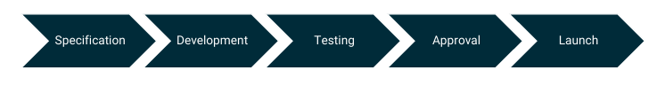

Development Deliverables
========================

This section outlines the required deliverables for UR+ product certification.

UR+ Project Workflow
--------------------

On the way to becoming a UR+ partner there are a sequence of milestones to hit. Those are described in more detail below.

.. raw:: html

   

   

     

       
Specification

       
Development

       
Testing

       
Approval

       
Launch

     

     
     

       <h3>Specification</h3>
       <h4>Estimated duration: 1 month</h4>
       
The specification stage is a key step. During the product specification, the product development is planned together with a UR Development Consultant. Together it is aligned on how and to what extent the product is being integrated for UR. If this is being done without alignment upfront, the resulting product may not fit for UR+ and the development needs to be started again.

       
During the specification the following topics, among others, will be discussed:

       <ul>
         <li>Overall product fit for UR - Size, weight, interfaces etc.</li>
         <li>Ways to integrate with the UR Robot - URCap, communication, HW adaptation</li>
         <li>Development timeline and milestones</li>
       </ul>
     

     
     

       <h3>Development</h3>
       <h4>Estimated duration: 3-6 months</h4>
       
Once both parties agree on the plan defined during the Specification stage, the Development phase starts. Dependent on the scope of the upcoming development, periodical meetings, dedicated calls combined with certain milestones or support when needed will be set up.

       
Upon finishing the development, align upfront with the correspondent contact at UR to get ready for testing. The self-testing checklist should be used as a reference to ensure readiness for the testing procedure.

     

     
     

       <h3>Testing</h3>
       <h4>Estimated duration: 2 months</h4>
       
During the Testing stage the UR Development Consultant will perform an active technical inspection of the product/system. Dependent on the product, timeline and other circumstances this testing can be performed in the following ways:

       <ul>
         <li><strong>UR Office:</strong> The product is shipped to a UR office</li>
         <li><strong>OnSite:</strong> A UR colleague is visiting the partner site</li>
         <li><strong>Remote:</strong> The product/system is setup at the partner location and the testing is performed remotely</li>
       </ul>
       
The following list is being used as the basis for the testing procedure:

       
<strong>1. End-user scenario:</strong> This session examines the product's alignment with intended real-world applications. Consultants analyze whether the system's performance meets scenario-specific requirements, identifying potential mismatches between designed functions and actual deployment contexts.

       
<strong>2. User experience:</strong> Focusing on human-robot interaction, this evaluation covers interface intuitiveness, error message clarity, and workflow efficiency. It aims to validate accessibility for operators of varying skill levels.

       
<strong>3. Software functionality and quality:</strong> Testing includes core software robustness, feature operation accuracy, and system stability. Emphasis is placed on identifying bugs, evaluating update procedures, and confirming performance consistency.

       
<strong>4. Mechanical, safety/collaborative, and electronics validation:</strong> This segment verifies physical integrity, safety compliance (e.g., ISO standards), and electronic system dependability. Inspections assess mechanical durability, force-limited collaborative operations, and electrical component stability.

       
<strong>5. Validation of fulfilling demands for customization:</strong> The analysis checks the system's adaptability to client-specific modifications, including hardware add-ons, software integrations, and process tailoring.

       
<strong>6. Validation of documentation and relevant certifications:</strong> This phase reviews technical manuals, safety guidelines, and certification documents for completeness and accuracy. It confirms that all provided materials meet industry standards and regulatory requirements.

       
Depending on the outcome there may be the need for one or more retesting sessions.

     

     
     

       <h3>Approval</h3>
       <h4>Estimated duration: 1 month</h4>
       
After the testing has been successful, the partner will receive a notice of UR+ Approval.

       
The partner will be expected to provide high quality launching materials including product landing page, pictures, user manuals, videos, descriptions, etc. to enable a decent product launch in UR+ Marketplace.

     

     
     

       <h3>Launch</h3>
       <h4>Estimated duration: 1 month</h4>
       
The UR team will prepare a product page in UR+ Marketplace and share it to partner for preview.

     

   

   

Testing Deliverables
----------------------------

The following table outlines the required deliverables for UR+ product testing and certification:

.. list-table:: 
   :header-rows: 1
   :widths: 18 41 41
   :class: tight-table

   * - Deliverable
     - UR+ Component
     - UR+ Application Kit
   * - **Hardware**
     - This is the main deliverable and should be presented in the way an end user can expect
       to receive the product. This will include your product, any external parts, mounting
       hardware and tools, and electrical components and tools. The end user should not need
       any extra equipment to set up the product.
     - This is the main deliverable and should contain all the subcomponents listed in the
       scope of the application kit. Each subcomponent, and the overall kit should contain
       all necessary equipment and parts to set up the kit.
   * - **Software**
     - If a URCap is required for product integration, this must be aligned with the UR+ team
       during the scoping phase. In such cases, the URCap should be made easily accessible to
       users—either via online download or provided on a USB stick and included in the Bill of
       Materials (BOM). Any external software necessary for product operation must also be
       provided in the same manner. If no URCap is provided, the product must still include all
       necessary resources to ensure a seamless integration and deployment experience. This
       includes sample programs, URScript code, configuration modules.
     - All URCaps used in the UR+ application kit must be provided. Any additional software
       needed must also be provided to the user. If the URCaps or external software is not
       available for easy download, it must be provided through a USB stick and added to the
       BOM. Hardware required to interface from the external software to the robot must also
       be included. If no URCap is provided, the product must still include all necessary
       resources to ensure a seamless integration and deployment experience. This includes
       sample programs, URScript code, configuration modules.
   * - **Documentation** (Common)
     - All UR+ Products must include a UR specific user manual that guides users through
       mechanical and electrical setup of the product on the robot, as well as information on
       the installation and navigation of the URCap and its functions. This can be a complete
       manual covering all relevant steps or merely providing UR specific information and
       linking to existing documentation for general topics.
       
       **The manual should cover if applicable:**
       
       1. Cobot TCP (Tool Center Point) configuration
       
       2. Cobot mounting configuration
       
       3. Cobot payload settings
       
       4. Tool-IO configuration
       
       5. Safety IO / Plan configuration
       
       6. BOM
       
       7. Others
       
       **The manual needs to cover product key specifications:**
       
       1. Product weight
       
       2. Product power (rated, peak, range)
       
       3. Product cleanroom level
       
       4. Product stroke (applies to external axis)
       
       5. Maximum velocity (applies to external axis)
       
       6. Maximum force (applies to gripper)
       
       7. Dependencies
       
       8. Others
       
       To ensure a reasonable overview, the scope of the documentation should include any
       further relevant internal testing documentation, third party approval reports, product
       specific manuals, and documentation of product design choices.
       
       The manual should have a version table exposing change log for easy tracking of changes.
       Here it is recommended to follow a version definition approach of **Major.FeatureChange-Patch**
       format.
       
       In case the product is released in multi-region, it is recommended that the partner
       prepares resources like the manual in the correspondent local languages prior to the
       release. **The default language is English.**
     - Same as UR+ Component.
   * - **Documentation** (Specific)
     - (NA)
     - UR+ Kits must include a UR specific user manual to guide users through installation
       and navigating through URCap functions. There can be individual manuals for each
       subcomponent of the UR+ Application Kit. There must be one master document for
       quick installation and goes through system installation.
   * - **Release Materials**
     - UR+ product launching requires partner to get below items ready and easy to access for
       end user:
       
       • **Landing product page** hosted on Partner's website. It needs to be exclusive to showcase product introduction, pictures, URCap (optional), manual (optional). **Containing 3rd brand robot with the product on landing page will not be acceptable.**
       
       • **2-4 high resolution product images** for UR MarketPlace gallery
       
       • **2-3 pictures of software/URCap UI**
       
       • **Logo picture**
     - Same requirements as UR+ Component.
   * - **Testing Artifacts**
     - Some UR+ testing may require separate components that can assist or aid in the approval
       of the product. These parts must be packed or labeled separately, to distinguish between
       "the product" and assistive parts.
     - Same requirements as UR+ Component.

     

.. note::
   The manual should have a version table exposing detailed change log for ease of change
   tracking. It is recommended to follow a version definition approach of **Major.Minor-Patch**
   format. In case the product is released in multi-region, partner should prepare local
   language manuals prior to the release.

Submission Format
-----------------

* All documents in PDF format
* Source files in editable format (Word, InDesign, etc.)
* Software packages with version numbers
* Organized folder structure

.. warning::
   Incomplete deliverables will delay the certification process. Ensure all items are ready
   before submission.

Version Control
---------------

Partners must maintain version control for all deliverables:

* Use semantic versioning (e.g., 1.0.0)
* Document changes between versions
* Maintain compatibility matrix with PolyScope versions
