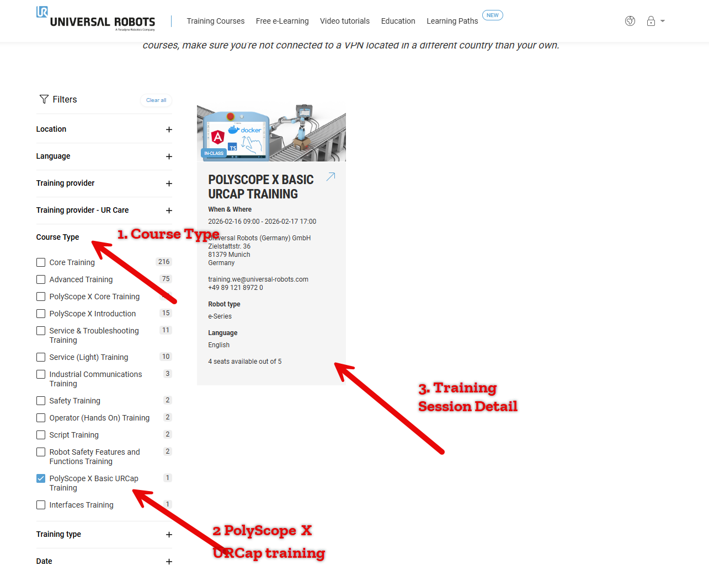
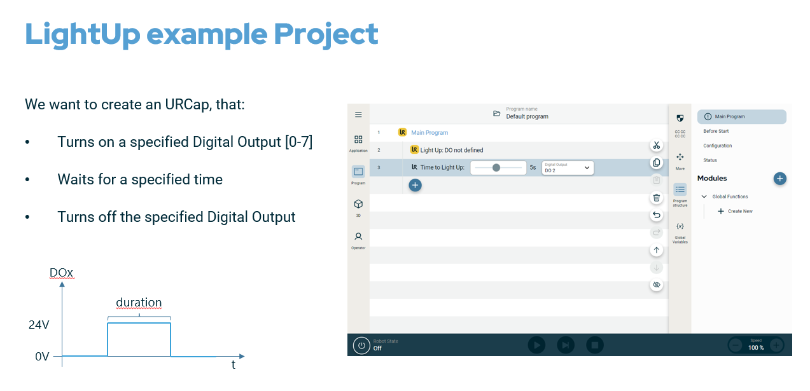
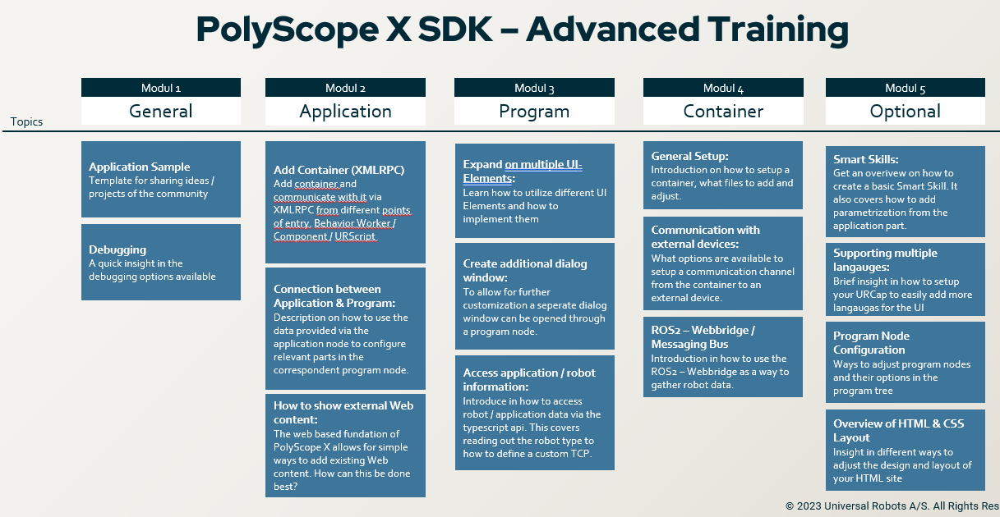

Resources for Development
=========================

This section provides support resources and contact information.

Getting Help
------------

If you need assistance with UR+ products, there are several resources available:

Community Resources
^^^^^^^^^^^^^^^^^^^

* `Universal Robots Documentation <https://docs.universal-robots.com/>`_
* `Universal Robots Forum <https://forum.universal-robots.com/>`_
* `Universal Robots Discord server <https://discord.com/invite/sEjRgEf6fp>`_
* `Sample code repositories <https://github.com/UniversalRobots/>`_
* `UR Marketplace <https://www.universal-robots.com/marketplace/>`_ is a showroom
  where you can view all approved products.
* `Universal Robots Support Page <https://www.universal-robots.com/support/>`_ has an
  extensive support page which includes links to our robot's user manual, CAD files,
  robot images, the URScript manual, and other documentation and software components. 
* `Universal Robots Download Center <https://www.universal-robots.com/articles/ur/documentation/legacy-download-center/>`_
  contains all the software and documentation for the robots and software.

Contact Information
^^^^^^^^^^^^^^^^^^^^
For technical consultation, please contact:

| **US:** KRMI@universal-robots.com
| **EMEA:** SKO@universal-robots.com, FLLU@universal-robots.com
| **APAC:** FUNH@universal-robots.com  

When contacting support, please provide:

1. Robot serial number
2. PolyScope version
3. URCap version
4. Description of the issue
5. Error messages (if any)

Frequently Asked Questions
--------------------------

**Q1: How do I check my PolyScope version?**

A: Go to **Settings** > **System** > **About** to view the PolyScope version.

**Q2: Can I install multiple URCaps?**

A: Yes, multiple URCaps can be installed simultaneously, provided there are no conflicts.

**Q3: How do I start the UR+ product launch process?**

A: Please upload your product information to the
`UR+ Product Submission Form <https://form.asana.com/?k=9UcMvnNd93yFrOqZQWUKJg&d=66083628180095>`_.
We will assign a dedicated colleague to work with you on the next steps.

**Q4: How can I quickly get started with PolyScope X URCap programming?**

A: We offer PolyScope X URCap SDK training (Entry / Advanced)to help developers quickly understand URCap
functionality and development techniques. Please visit the
`Universal Robots Academy Training Courses <https://academy.universal-robots.com/our-training-courses/>`_
page and select "PolyScope X URCap Training" in the Course Type filter to find
specific course information.

**Entry Agenda [2 day program]:**

* How to get started and setup your system to run the SDK inside the development container
* Start and access the PolyScope X URSim
* Create a URCap project
* Develop a simple URCap Light-Up following the Getting Started section

**Advanced Agenda [2 day program]:**

Reporting Issues
----------------

`To report a bug or issue via CenterCode <https://ur.centercode.com/enter/>`_

.. tip::
   Include screenshots or videos when reporting visual issues.

