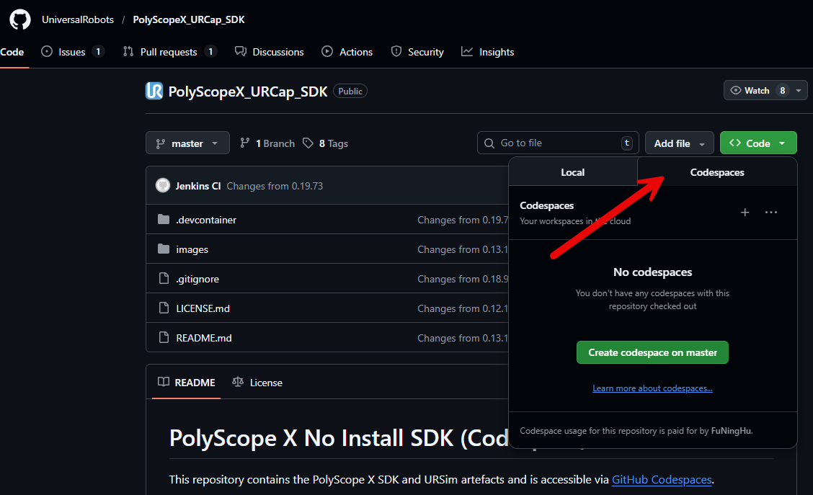
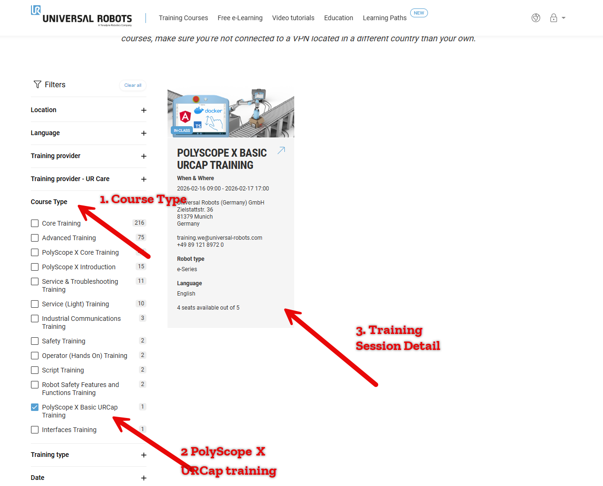
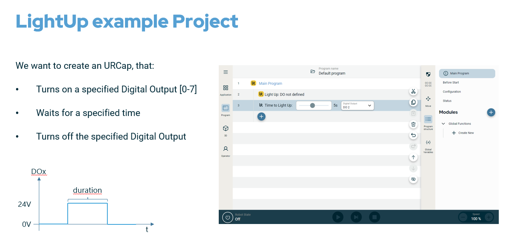
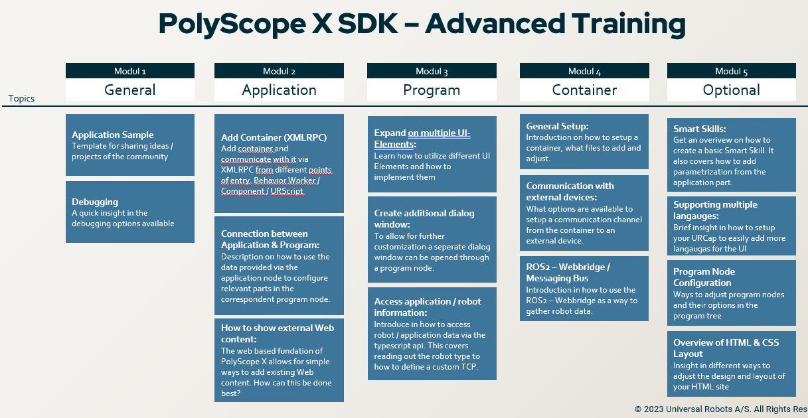
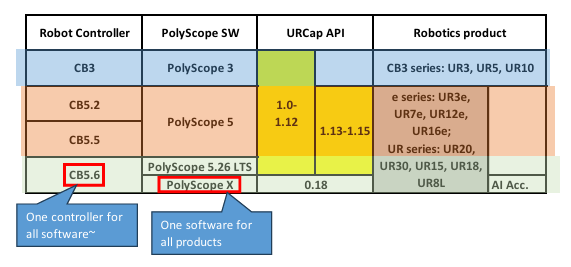

Resources for Development
=========================

Universal Robots provides a range of resources to support development. The following list is a summary of 
the most prominent sites to visit.

Community Resources
-------------------

.. raw:: html

   <ul>
   <li><a href="https://www.universal-robots.com/support/" target="_blank">Universal Robots Support & Download page</a>: Wide range of articles, manuals and SW Downloads.</li>
   <li><a href="https://docs.universal-robots.com/" target="_blank">Universal Robots Documentation</a>: Dedicated URCap, ROS2 and further documentation.</li>
   <li><a href="https://forum.universal-robots.com/" target="_blank">Universal Robots Forum</a>: Community to discuss questions and search existing threads for insights.</li>
   <li><a href="https://discord.com/invite/sEjRgEf6fp" target="_blank">Universal Robots Discord server</a>: Discord server to discuss a broad range of UR Topics.</li>
   <li><a href="https://github.com/UniversalRobots/" target="_blank">Sample code repository</a>: UR Github page.</li>
   <li><a href="https://www.universal-robots.com/marketplace/" target="_blank">UR Marketplace</a>: Showroom displaying all available UR+ products and solutions.</li>
   <li><a href="https://ur.centercode.com/enter/" target="_blank">CenterCode</a>: This is UR's Beta software testing platform where you can access the latest product information and provide feedback on your experience.</li>
   </ul>

Contact Information
^^^^^^^^^^^^^^^^^^^^
For technical consultation, please contact:

| **US:** KRMI@universal-robots.com
| **EMEA:** SKO@universal-robots.com, FLLU@universal-robots.com
| **APAC:** FUNH@universal-robots.com  

When contacting support, please provide:

1. Robot serial number
2. PolyScope version
3. URCap version
4. Description of the issue
5. Error messages (if any)

Frequently Asked Questions
--------------------------

.. raw:: html

   

   

     

       

         Q1: How do I check my PolyScope version?
         ▼
       

       

         
Go to <strong>Settings</strong> &gt; <strong>System</strong> &gt; <strong>About</strong> to view the PolyScope version.

       

     

     

       

         Q2: Can I install multiple URCaps?
         ▼
       

       

         
Yes, multiple URCaps can be installed simultaneously, provided there are no conflicts.

       

     

     

       

         Q3: How do I start the UR+ product launch process?
         ▼
       

       

         
Please upload your product information to the 
         <a href="https://form.asana.com/?k=9UcMvnNd93yFrOqZQWUKJg&d=66083628180095" target="_blank">UR+ Product Submission Form</a>.
         We will assign a dedicated colleague to work with you on the next steps.

         
Please check corresponding content in <a href="product_lifecycle_management.html" target="_blank">Product Life Cycle Management</a>.

       

     

     

       

         Q4: What Control Box, PolyScope, URCap API and Robot Versions are compatible?
         ▼
       

       

         
The table below illustrates the compatibility relationships between Universal Robots' control box,
         software, URCap API versions, and robotic product lines:

         
       

     

     

       

         Q5: What technical skills are required for PolyScope X URCap development?
         ▼
       

       

         
Developing URCaps for PolyScope X requires knowledge in the following technology stack:

         <ul>
           <li><a href="https://www.universal-robots.com/manuals/EN/HTML/SW10_11/Content/Landingpages/WebPolyX/LandingScript.htm" target="_blank">URScript</a> - Universal Robots scripting language for robot control, as for this article written date(2026-Jan-16) URScript Directory is the with latest version 10.11.</li>
           <li><strong>RTDE, Rest-API</strong> - Real-Time Data Exchange and REST API for robot communication</li>
           <li><strong>Robotics</strong> - General robotics knowledge and concepts to facilitate the development of the product</li>
           <li><strong>HTML, CSS, TypeScript</strong> - Frontend web technologies for UI development</li>
           <li><a href="https://angular.dev/" target="_blank">Angular</a> - Frontend framework used in PolyScope X, as for this article written date(2026-Jan-16) PolyScope X is adopting Angular 19.</li>
           <li><strong>Docker</strong> - Containerization for development environment and deployment</li>
         </ul>
       

     

     

       

         Q6: How can I quickly get started with PolyScope X URCap programming?
         ▼
       

       

         
We offer PolyScope X URCap SDK training (Entry / Advanced) to help developers quickly understand URCap
         functionality and development techniques. Please visit the
         <a href="https://academy.universal-robots.com/our-training-courses/" target="_blank">Universal Robots Academy Training Courses</a>
         page and select "PolyScope X URCap Training" in the Course Type filter to find
         specific course information.

         

         

         
Entry Agenda [2 day program]:

         

           

             
MODULE 1

             
Environment Setup

             
How to get started and setup your system to run the SDK inside the development container

           

           

             
MODULE 2

             
URSim Simulator

             
Start and access the PolyScope X URSim

           

           

             
MODULE 3

             
Create Project

             
Create a URCap project

           

           

             
MODULE 4

             
Light-Up URCap

             
Develop a simple URCap Light-Up following the Getting Started section

           

         

         

         

         
Advanced Agenda [2 day program]:

         

         

           

             
MODULE 1 — General

             

               
Application Sample

               
Template for sharing ideas / projects of the community

             

             

               
Debugging

               
A quick insight in the debugging options available

             

           

           

             
MODULE 2 — Application

             

               
Add Container (XMLRPC)

               
Add container and communicate with it via XMLRPC from different points of entry: Behavior Worker / Component / URScript.

             

             

               &#9733;
               
Connection between Application & Program

               
Description on how to use the data provided via the application node to configure relevant parts in the correspondent program node.

             

             

               &#9733;
               
How to show external Web content

               
The web based foundation of PolyScope X allows for simple ways to add existing Web content.

             

           

           

             
MODULE 3 — Program

             

               
Expand on multiple UI-Elements

               
Learn how to utilize different UI Elements and how to implement them.

             

             

               &#9733;
               
Create additional dialog window

               
To allow for further customization a separate dialog window can be opened through a program node.

             

             

               
Access application / robot information

               
Introduce in how to access robot / application data via the typescript API. This covers reading out the robot type to how to define a custom TCP.

             

           

           

             
MODULE 4 — Container

             

               
General Setup

               
Introduction on how to setup a container, what files to add and adjust.

             

             

               
Communication with external devices

               
What options are available to setup a communication channel from the container to an external device.

             

             

               
ROS2 – Webbridge / Messaging Bus

               
Introduction in how to use the ROS2 – Webbridge as a way to gather robot data.

             

           

           

             
MODULE 5 — Optional

             

               
Smart Skills

               
Get an overview on how to create a basic Smart Skill. It also covers how to add parametrization from the application part.

             

             

               &#9733;
               
Supporting multiple languages

               
Brief insight in how to setup your URCap to easily add more languages for the UI.

             

             

               
Program Node Configuration

               
Ways to adjust program nodes and their options in the program tree.

             

             

               
Overview of HTML & CSS Layout

               
Insight in different ways to adjust the design and layout of your HTML site.

             

           

         

         

       

     

     

       

         Q7: How to quickly open PolyScope X simulator?
         ▼
       

       

         
On the official Universal Robots GitHub, we provide a <a href="https://github.com/UniversalRobots/PolyScopeX_URCap_SDK" target="_blank">Codespace-based SDK</a> that requires no local installation. You can open the SDK environment and run URSim there.

         

           
         

         
Generally, Codespace offers a free usage quota that is sufficient for regular users, making this the fastest way to access the PolyScope X software.

         
<strong>What you need to prepare:</strong>

         <ol>
           <li>A GitHub account</li>
           <li>A stable and fast internet connection</li>
         </ol>
         
<strong>Important Note:</strong> The simulator running here has minor differences in protocol compared to the real robot. We will explain these differences in detail during the Entry/Advanced SDK training.

       

     

   

   

Reporting Issues
----------------

.. raw:: html

   <a href="https://ur.centercode.com/enter/" target="_blank">To report a bug or issue via CenterCode</a>

.. tip::
   Include screenshots or videos when reporting visual issues.

