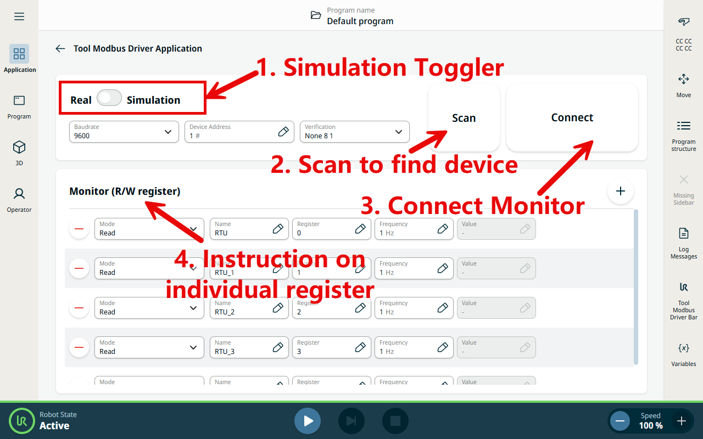
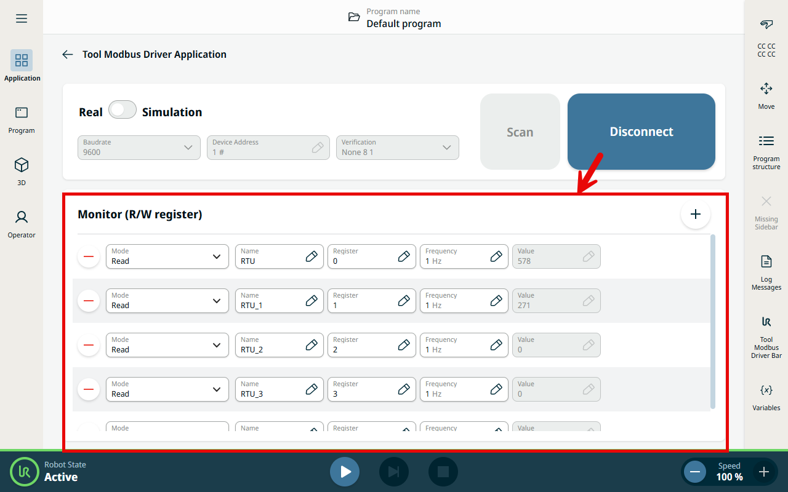
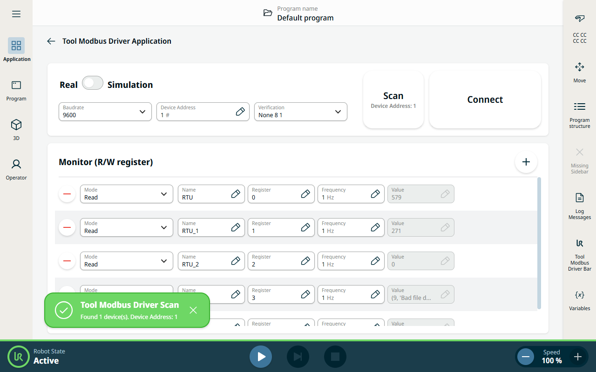
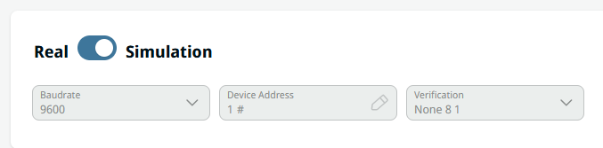

Tool Modbus Driver (URCapX)
====================================

This project offers a URCapX tooling that facilitates customized Modbus RTU
communication over tool-IO.

Dependencies
------------

PolyScope X 10.13+.

----

Using the ApplicationNode
-------------------------

The ``ApplicationNode`` is the persisted configuration object for this app node.
Its interface is defined in
``tool-modbus-driver-frontend/src/app/components/tool-modbus-driver-app/tool-modbus-driver-app.node.ts``.

.. list-table::
   :header-rows: 1
   :widths: 25 75

   * - Field
     - Description
   * - ``deviceAddress``
     - Modbus slave address (1–254)
   * - ``baudrate``
     - Baud rate, e.g. ``9600``
   * - ``verification``
     - Serial verification: ``None 8 1`` / ``Odd 8 1`` / ``Even 8 1`` (parity / bytesize / stopbits)
   * - ``isSimulation``
     - Real / Simulation toggle
   * - ``isConnect``
     - Whether connected (mirrors the Connect/Disconnect button state)
   * - ``monitorSignals``
     - List of monitored signals; each has ``mode`` (Read/Write), ``name``, ``register``, ``frequency``, ``writeValue``, ``autoIncrement``

Monitoring registers (Monitor)
^^^^^^^^^^^^^^^^^^^^^^^^^^^^^^^

Click **Connect** to open the connection, then use the **Monitor (R/W register)**
card to watch and drive registers live:

- Press **+** to add a signal row; press **−** to remove one.
- Set each row's **Mode** (Read/Write), **Name**, **Register**, and **Frequency** (Hz).
- In **Read** mode the polled value is shown in the **Value** field.
- In **Write** mode type a value to send; enable **auto increment by 1** to increment and
  write it every ``1/Frequency`` seconds.

Scanning for the device address
^^^^^^^^^^^^^^^^^^^^^^^^^^^^^^^^

If you do not know the device's slave address, click **Scan**. It probes
addresses from 1 and stops at the first device that responds, showing the found
Device Address on the button and in a success notification. Set the matching
**Baudrate** / **Verification** before scanning so the device can answer.

----

Reading/Writing Registers with Script in the Program Page
---------------------------------------------------------

Once this app node is added to a program, ``generatePreamble`` automatically
injects the script functions below (defined in
``tool-modbus-driver-app.behavior.worker.ts``). They can be called directly from
Script nodes / expressions:

.. list-table::
   :header-rows: 1
   :widths: 45 55

   * - Script function
     - Purpose
   * - ``tool_modbus_read(register_address_start, count=1)``
     - Read registers; returns a list of ``count`` values
   * - ``tool_modbus_write(register_address_start, data, count=1)``
     - Write registers; ``data`` is a single value or comma-separated values
   * - ``tool_modbus_open(com, bau, my_id)``
     - Power on the tool and open the Modbus master
   * - ``close_modbus_master()``
     - Close the Modbus master
   * - ``is_tool_modbus_service_reachable()``
     - Whether the backend service is reachable
   * - ``is_tool_modbus_connected()``
     - Whether currently connected
   * - ``get_modbus_error_info()``
     - Read error information
   * - ``get_modbus_my_id()``
     - Read the current slave address

Examples:

.. code-block:: python

   # Read 1 value from register 100
   value = tool_modbus_read(100, 1)

   # Write 5 to register 100
   tool_modbus_write(100, 5, 1)

   # Write registers 100 and 101 in one call
   tool_modbus_write(100, "5,6", 2)

.. admonition:: Notes
   :class: tip

   - Register reads/writes use the connection opened by ``openMaster`` in the
     preamble (which applies the node's baud rate / address / verification).
   - In **Simulation** mode the serial port is not actually opened, so script
     calls do not communicate with hardware.

----

Disabling the Tool or Using a Custom Communication Setup
--------------------------------------------------------

Disabling the tool
^^^^^^^^^^^^^^^^^^^

When you do not need the Tool Modbus feature, select **Simulation** on the
application page. This turns the feature off without affecting the robot runtime
(the tool serial port is not opened and ``set_tool_communication`` is not called).

Custom communication setup
^^^^^^^^^^^^^^^^^^^^^^^^^^^

If you need a custom communication setup, skip the application node's
auto-generated preamble and add the following script to the **Before Start**
section instead:

.. code-block:: python

   tool_modbus_driver = rpc_factory("xmlrpc","http://servicegateway/funh/tool-modbus-driver/tool-modbus-driver-backend/xmlrpc/")
   set_tool_voltage(24)
   set_tool_communication(True, 9600, 0, 1, 1.0, 3.5)
   sleep(0.2)
   tool_modbus_driver.openMaster("/dev/ur-ttylink/ttyTool", "9600", 1, "None 8 1")

Then, in the **Robot Program** section, read and write registers with:

.. code-block:: python

   # Read registers
   value = tool_modbus_read(register_address_start, count=1)

   # Write registers
   tool_modbus_write(register_address_start, data, count=1)

----

Further help
------------

Get more help by contacting ( funh@universal-robots.com )

----

.. admonition:: Download
   :class: note

   .. raw:: html

      
URCapX download:
      <a href="https://github.com/FuNingHu/tool-modbus-driver-x/tree/main/target" target="_blank">LINK</a>

----

License
-------

Released under the **MIT License**. The software is
provided "as is", without warranty of any kind. You are free to use, copy,
modify, and distribute it, provided the original copyright and license notice
are retained.

.. raw:: html

   
See the full license text:
   <a href="https://github.com/FuNingHu/tool-modbus-driver-x/blob/main/LICENSE" target="_blank">LICENSE</a>

