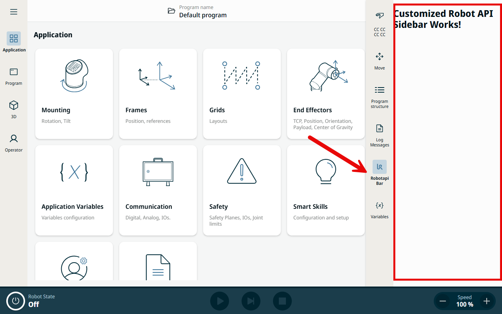
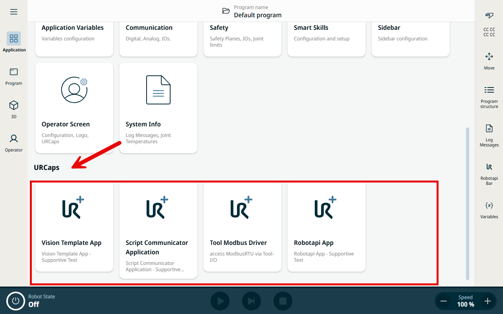
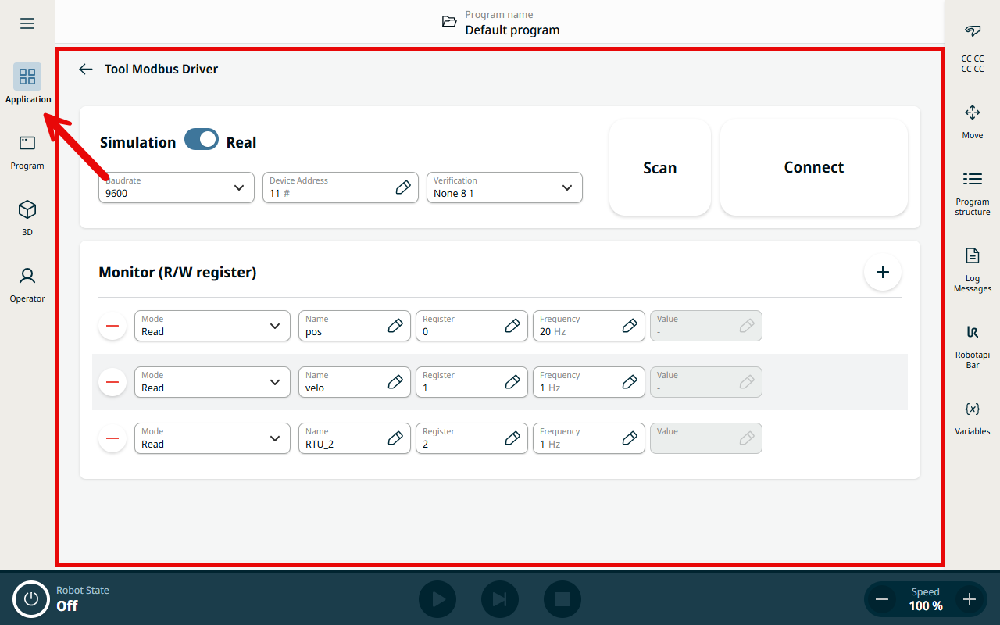
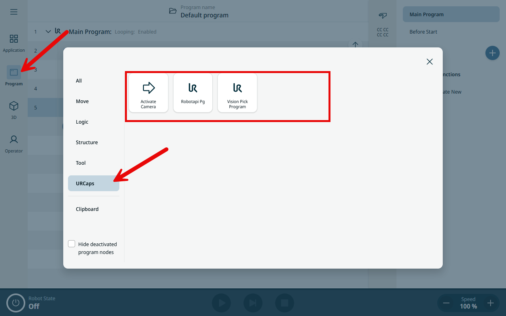
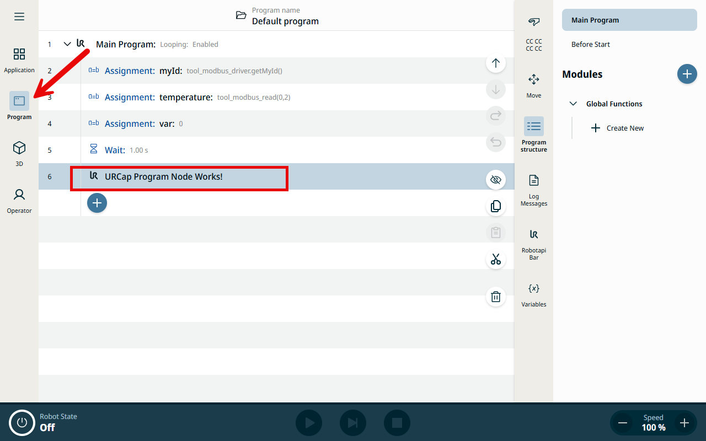
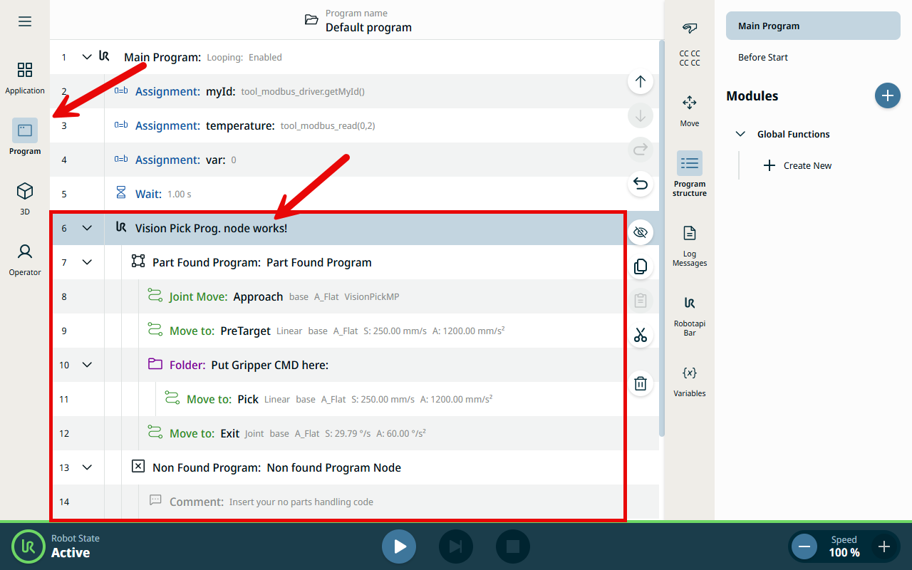
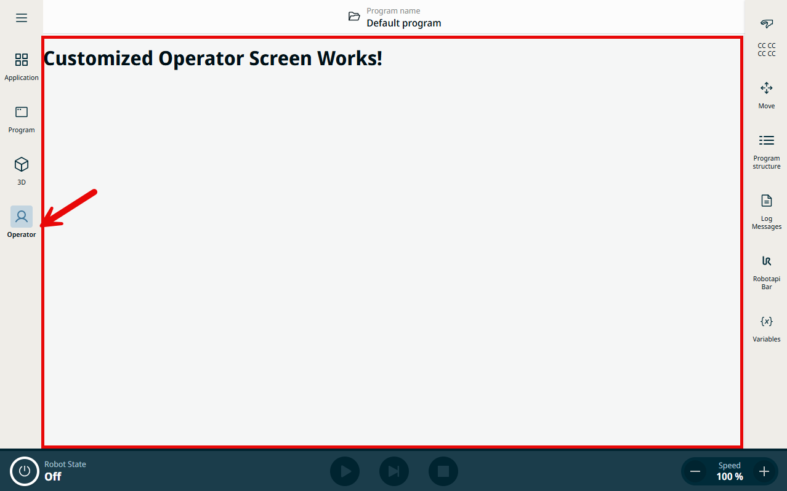
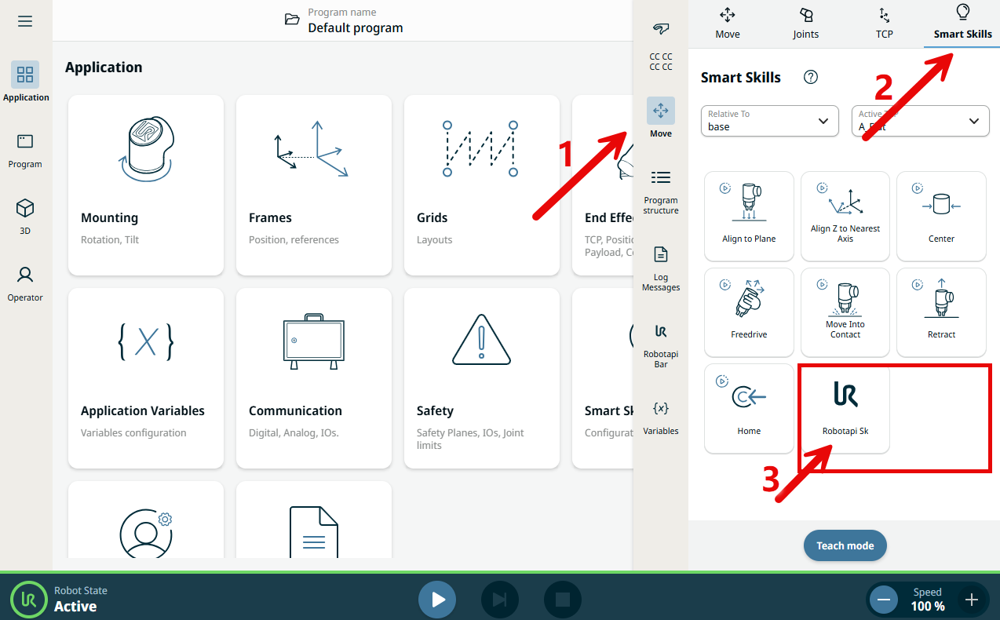
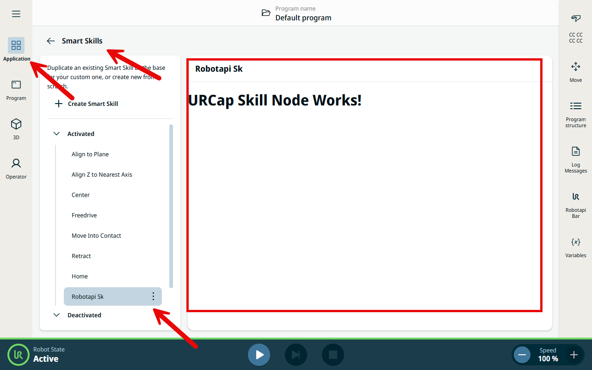

URCap Contribution Overview
===========================

A URCap for PolyScope X extends cobot UI through **contributions**. Each
contribution type plugs into a different part of PolyScope X and serves a
different purpose. This article offers a quick overview over the five most
common contributions, with a use-case description and a reference-code
link for each.

.. raw:: html

   
This overview is presented based on <strong>SDK 0.20.49</strong> and
   <strong>URSim 10.13</strong>. The author believes more contribution
   descriptions will be added over time (for example, Tool Control
   Contribution). Please follow the
   <a href="https://www.universal-robots.com/articles/?filter_Applications[]=100734&filters[]=100734" target="_blank">release note</a>
   for updates.

.. note::
   Most reference implementations ship with the PolyScope X SDK under the
   ``/samples/`` folder; the path is listed under each contribution below.

----

1. Sidebar
----------

.. raw:: html

   
A <strong><a href="https://docs.universal-robots.com/PolyScopeX_SDK_Documentation/build/SDK-v0.21/HowToGuides/sidebar.html" target="_blank">Sidebar</a></strong>
   contribution provides a quickly-accessible panel that can be opened at any
   time, from any other screen. This makes it well suited for quick-action
   buttons or status monitoring. A Sidebar <strong>cannot contribute
   URScript</strong>.

.. raw:: html

   
<strong>Contribution reference code:</strong>
   SDK sample <code class="docutils literal notranslate">/samples/global-variables-sidebar-item</code>

----

2. Application
--------------

An **Application** contribution provides a wide, spacious screen that is
convenient for the static setup of a device integration — for example IP
settings, connectivity configuration, fixed configuration parameters, function
definitions, and global-variable initialization. An Application releases its
script into the **Before Start** section, so this script runs **only once** when
the Robot Program starts.

.. raw:: html

   
<strong>Contribution reference code:</strong>
   <a href="https://github.com/FuNingHu/advanced-rtde-x-extended/tree/main" target="_blank">advanced-rtde-x-extended</a>

----

3. Program Node
---------------

A **Program Node** contribution provides only a narrow node panel. Its script
is released into the **main loop** of the program, which makes the Program Node
well suited for robot process/flow control.

.. raw:: html

   
<strong>Contribution reference code:</strong>
   SDK sample <code class="docutils literal notranslate">/samples/ur-program-nodes</code>

----

4. Operator Screen
------------------

.. raw:: html

   
An <strong><a href="https://docs.universal-robots.com/PolyScopeX_SDK_Documentation/build/SDK-v0.21/HowToGuides/operatorscreen.html" target="_blank">Operator Screen</a></strong>
   contribution provides a wide screen that stays accessible even while the robot
   is in <strong>remote control</strong> — which is very useful. An Operator
   Screen <strong>cannot contribute URScript</strong>.

.. raw:: html

   
<strong>Contribution reference code:</strong>
   SDK sample <code class="docutils literal notranslate">/samples/simple-operator-screen</code>

----

5. Smart Skill
--------------

.. raw:: html

   
A <strong><a href="https://docs.universal-robots.com/PolyScopeX_SDK_Documentation/build/SDK-v0.21/HowToGuides/smart-skill.html" target="_blank">Smart Skill</a></strong>
   contribution adds a button that executes some immediately-sent URScript. It
   also comes with a customizable configuration panel used to configure that
   URScript. However, its script is <strong>not</strong> released into the robot
   program.

.. raw:: html

   
<strong>Contribution reference code:</strong>
   SDK sample <code class="docutils literal notranslate">/samples/smart-skill-teach-mode</code>

